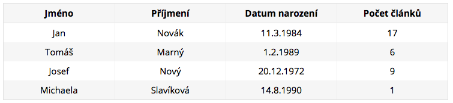
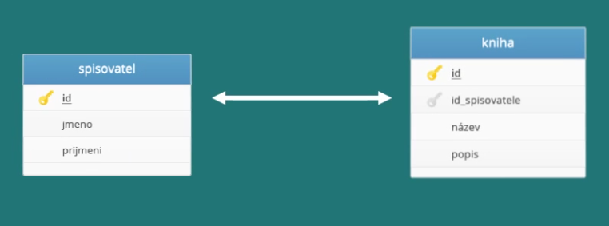
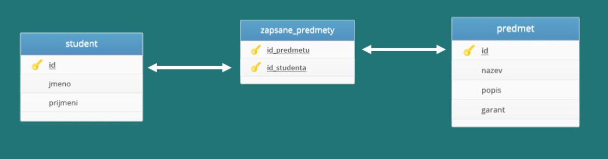

# Úvod do databází

## Co je to databáze?
* Místo pro ukládání dat
* Odborné databáze staví na dvou pojmech SRBD(systém řízení báze dat), který definuje jak pracovat s daty, a DB(Báze dat) představující data samotná
* Nejčastěji používané databáze jsou relační databáze
* Databázové systémy: MySql, MS SQL server, Oracle
* Všechny relační databáze mají společné, že pro vyhledávání a práci s daty používají jazyk SQL
* Příkladem může být kartotéka ve které jsou data uložena pomocí určitého systému nejčastěji podle jména a data narození


## Relační databáze
Relační databáze je založena na tabulkách. Každá tabulka obsahuje položky jednoho typu. Můžeme mít tedy tabulku Uživatelé, další tabulku Články a další třeba Komentáře.
Databázovou tabulku si můžeme představit třeba jako tabulku v Excelu. Tabulka uživatelé by mohla vypadat takto:

<div aling="center">
	
</div>

Položky (konkrétně zde uživatelé) ukládáme na jednotlivé řádky, sloupce pak označují atributy (vlastnosti, chcete-li), které položky mají. MS-SQL databáze je typovaná, to znamená, že každý sloupec má pevně stanovený datový typ (číslo, znak, krátký text, dlouhý text...) a může obsahovat hodnoty jen tohoto typu. Pokud chceme s relační databází rozumně pracovat, každý řádek v tabulce by měl být opatřený unikátním identifikátorem. U uživatelů by to mohlo být třeba rodné číslo, mnohem častěji se však používají identifikátory umělé a to tak, že uživatele prostě očíslujeme. K tomu se dostaneme později.

Slovo relační označuje vztah (anglicky relation). Ten je mezi tabulkami nebo mezi entitami v jedné tabulce. To si ale necháme na jindy a zatím budeme pracovat jen s jednou tabulkou zároveň.

**V bodech:**
* Základem relační databáze je tabulka ve které jsou uložena data
* Tabulek může být v databázi několik a tyto vazby mohou být na sobě určitým způsobem závislé -> existuje mezi nimi vazba (relace)
* Každá tabulka se skladá ze sloupců a rádků


## Základní pojmy relačních databází
**Tabulka**
* Základní databázový objekt, který slouží k ukládání dat do paměťového prostoru relační databáze.
* Databázovou tabulku si můžeme představit jako jako běžnou dvourozměrnou tabulku, která má pevně daný počet a význam jednotlivých položek, které tvoří sloupce tabulky.

**Sloupec**
* Sloupce představují atributy např. jméno, příjmení, město...
* Každý sloupec má definovaný určitý datový typ (číslo, text, datum, logická hodnota) a integritní omezení (musí být vyplněn, pouze kladné čísla, atd.)

**Řádek**
* Reprezentuje jeden záznam v tabulce.
* Například v tabulce Uživatelé představuje jeden řádek jednoho uživatele.

**Primární klíč**
* Jednoznačný identifikátor záznamu(řádku v tabulce).
* Slouží pro vytváření vztahu mezi tabulkami, umožní nám identifikovat, které záznamy patří k danému klíči v druhé tabulce.

**Cizí klíč**
* Identifikátor záznamu v druhé tabulce
* Slouží pro vytváření vztahu mezi tabulkami, umožní nám identifikovat, které záznamy patří k danému klíči v druhé tabulce.

**Index**
* Databázové indexy složí ke zrychlení přístupu k datům a měly by se používat u všech sloupců, podle kterých se vyhledává, třídí nebo podle kterých se spojují tabulky.
* Při ukládání dat do tabulek nejsou záznamy obvykle nijak tříděny a ukládají se většinou za sebe tak, jak byly postupně vloženy.
* Index umožňuje rychlejší vyhledávání, díky seřazení dat do stromové struktury.


## Vazby mezi tabulkami

**Co je to relace?**
* Některé tabulky mohou být na sobě závislé, existuje mezi nimi určitá vazba, které se říká relace.
* Příkladem může být tabulka Kontakty, která je závislá na tabulce Uživatelé.
* V relačních databázích máme tři druhy relací.

**Relace 1:1**
* Relace kdy jeden záznam v tabulce odpovídá právě jednomu záznamu z jiné databázové tabulky.
* Nejjednodušší relace
* Využití pro zpřehlednění rozsáhlých tabulek

<div align="center">
    
</div>

**Relace 1:n**
* Relace přiřazuje jednomu záznamu z tabulky více záznamů z jiné tabulky.
* Jednu tabulku tak propojíme pomocí cizího klíče s primárním klíčem druhé tabulky.
* Nejpoužívanější typ relace.

<div align="center">
    
</div><br>

**Relace m:n**
* Relace se používá mezi dvěma tabulkami, kde více záznamu z jedné tabulky může odpovídat více záznamům z tabulky druhé.
* Složitější relace, pro její provedení je třeba zavést novou tabulku (vazební).
* Přes vazební tabulku tabulky propojíme a vytvoříme relaci m:n.

<div align="center">
    
</div>


## Základní datové typy
**K čemu slouží?**
* Každý sloupec v tabulce má datový typ, ten definuje jaká data můžeme do tohoto slupce ukládat.

**Číselné datové typy**
* INT - bežná celá čísla
* BIGINT - velká celá čísla
* FLOAT - malá čísla v pohyblivé řadové čárce
* DOUBLE - velká čísla v pohyblivé řadové čárce


Poznámka: Každý výše zmíněný datový typ má definovaný rozsah, který záleží na implementaci databáze.

Poznámka: Pokud nepotřebujeme záporné hodnoty můžeme použít datový typ UNSIGNED, který zamezí používání záporných hodnot a u celočíselných typů zdvojnásobí rozsah kladných hodnot.

**Řetězcové datové typy**
* CHAR - řetězec pevně dané délky do 255 znaků
* VARCHAR - řetězec proměnné délky do 255 znaků
* TEXT - řetězec schopný uložit dlouhý text větší než 255 znaků

**Datum a čas**
* DATE - slouží pro uložení datumu ve formátu YYYY-MM-DD
* TIME - čas ve formátu hh:mm:ss
* DATETIME - datum s časem ve formátu YYYY-MM-DD hh:mm:ss

**Hodnota NULL**
* jestliže se ve sloupci záznamu nachází hodnota NULL, znamená to, že v něm nic není
* Tato hodnota znamená nezadáno nebo neznámo


## Normalizace relačních databází
**Co to je?**
* Postup popisující jak správně navrhnout a vytvořit strukturu databáze.
* Databáze by měla vyhovovat tzv. normálním formám
* Normální formy určují jak navrhnout tabulky, tak aby nedošlo k duplicitám a nekonzistentním datům.
* Existuje několik normálních forem, běžně se vyžaduje dodržení alespoň prvních tří.

**První normální forma**: Tabulka je v první normální formě, pokud každý její atribut obsahuje jen atomické hodnoty

**Druhá normální forma**: Tabulka je v druhé normální formě, pokud splňuje podmínky první normální formy a každý neklíčový atribut je plně závislý na celém primárním klíči(nejen na jeho části)

**Třetí normální forma**: Tabulka se nachází v třetí normální formě, splňuje-li předchozí dvě normální formy a všechny neklíčové atributy jsou vzájemně nezávislé


## Jazyk SQL
**Co to je?**
* Dotazovací jazyk určený pro práci s daty v relačních databázích
* Anglicky Structured Query Language
* Jinak řečeno je to jazyk umožňující komunikovat s databázi jednoduchou angličtinou

**Okénko do historie**

V 70. letech 20. století probíhal ve firmě IBM výzkum relačních databází. Bylo nutné vytvořit sadu příkazů pro ovládání těchto databází. Vznikl tak jazyk SEQUEL (Structured English Query Language). Cílem bylo vytvořit jazyk, ve kterém by se příkazy tvořily syntakticky co nejblíže přirozenému jazyku (angličtině).

K vývoji jazyka se přidaly další firmy. V r. 1979 uvedla na trh firma Relational Software, Inc. (dnešní Oracle Corporation) svoji relační databázovou platformu Oracle Database. IBM uvedla v roce 1981 nový systém SQL/DS a v roce 1983 systém DB2. Dalšími systémy byly např. Progres, Informix[1] a SyBase. Ve všech těchto systémech se používala varianta jazyka SEQUEL, který byl přejmenován na SQL.

Relační databáze byly stále významnější, a bylo nutné jejich jazyk standardizovat. Americký institut ANSI původně chtěl vydat jako standard zcela nový jazyk RDL. SQL se však prosadil jako de facto standard a ANSI založil nový standard na tomto jazyku. Tento standard bývá označován jako SQL-86 podle roku, kdy byl přijat.

V dalších letech se ukázalo, že SQL-86 obsahuje některé nedostatky a naopak v něm nejsou obsaženy některé důležité prvky týkající se hlavně integrity databáze. V roce 1992 byl proto přijat nový standard SQL-92 (někdy se uvádí jen SQL2). Zatím nejnovějším standardem je SQL3 (SQL-99), který reaguje na potřeby nejmodernějších databází s objektovými prvky.

Standardy podporuje prakticky každá relační databáze, ale obvykle nejsou implementovány vždy všechny požadavky normy. A naopak, každá z nich obsahuje prvky a konstrukce, které nejsou ve standardech obsaženy. Přenositelnost SQL dotazů mezi jednotlivými databázemi je proto omezená.

**Příkazy pro definici dat**
```SQL
-- Vytvoření tabulky
	CREATE TABLE [dbo].[Uzivatele]
	(
	    [Id] INT NOT NULL PRIMARY KEY IDENTITY,
	    [Jmeno] NVARCHAR(60) NOT NULL,
	    [Prijmeni] NVARCHAR(60) NOT NULL,
	    [DatumNarozeni] DATE NOT NULL,
	    [PocetClanku] INT NOT NULL
	)

-- Smazání tabulky
DROP TABLE [dbo].[Uzivatele]
```
**Příkazy pro vkládání a mazání dat v tabulce**
```SQL
-- Vložení záznamu do tabulky
	INSERT INTO [Uzivatele] (
	        [Jmeno],
	        [Prijmeni],
	        [DatumNarozeni],
	        [PocetClanku])
	VALUES (
	'Jan', 'Novák', '1984-11-03', 17
	);

-- Vymazání záznamu
  DELETE FROM [Uzivatele] WHERE [Id] = 2;

-- Editace záznamu
	UPDATE [Uzivatele] 
	SET [Prijmeni] = 'Dolejší', 
		[PocetClanku] = [PocetClanku] + 1 
	WHERE [Id] = 1;
```
**Dotazy nad tabulkou**
```SQL
-- Vypsání komentářů napsaných v druhém kvartálu roku 2012, seřazených podle data
	SELECT Obsah,Datum
	FROM Komentar
	WHERE Datum BETWEEN '2012-3-1' AND '2012-6-30'
	ORDER BY Datum;

-- Výpis uživatelů, jejichž přezdívka začíná na určité písmeno (využívá se na webu pro procházení uživatelů)
	SELECT Nick, UzivatelID 
	FROM Uzivatel
	WHERE Nick LIKE 'D%';

-- Zjistěte, kolik uživatelů má email se Seznamu
	SELECT COUNT(*) Vysledek
	FROM Uzivatel
	WHERE Email LIKE '%@seznam.cz';

-- Přejmenování sekce (sekce jsou často přejmenovávány z důvodu SEO optimalizace), u přejmenování jsou parametry starý název a nový název
	UPDATE Sekce
	SET Nazev = ('České hry')
	WHERE Nazev = 'Hry';

-- Zjistit celkové body (součet jednotlivých score) výsledků testů od určitého uživatele, podle jeho ID
	SELECT SUM(Skore) Vysledek
	FROM VysledekTestu
	WHERE UzivatelID = 2;

-- Vypsání nejnovějšího článku včetně nicku autora do widgetu na titulní stránce
	SELECT 	TOP 1
        	c.Perex,
        	c.PrettyURL,
        	c.Titulek,
        	c.Publikovano,
        	u.Nick
	FROM Clanek c, Uzivatel u
	WHERE (u.UzivatelID = c.AutorID)
	ORDER BY c.Publikovano DESC;

-- Vypsání článku a přezdívky autora podle URI článku
	SELECT 	c.Perex,
        	c.PrettyURL,
        	c.Keywords,
        	c.Titulek,
        	c.Obsah,
        	c.Publikovano,
        	u.Nick
	FROM Clanek c, Uzivatel u
	WHERE ((c.PrettyURL = 'co-je-to-algoritmus')
        AND (c.AutorID = u.UzivatelID));

-- Vypsání článků v určité sekci podle názvu sekce
	SELECT
        	Clanek.PrettyURL,
        	Clanek.Titulek
	FROM 	Clanek, ClanekSekce, Sekce
	WHERE
    		(ClanekSekce.ClanekID = Clanek.ClanekID) AND
     		(ClanekSekce.SekceID = Sekce.SekceID) AND
        	(Sekce.Nazev = 'Algoritmy');

-- Vypsání prvních 15ti komentářů k danému článku, seřazených od nejnovějších po nejstarší podle URI článku a to včetně nicku uživatele, který komentář napsal.
	SELECT TOP 15
        	k.Obsah,
        	k.Datum,
        	c.PrettyURL,
        	u.Nick
	FROM Komentar k
        JOIN Clanek c
                ON (c.ClanekID = k.ClanekID)
        JOIN Uzivatel u
                ON (k.UzivatelID = u.UzivatelID)
	WHERE (c.PrettyURL = 'cheese-mouse-oddechova-plosinovka')
	ORDER BY k.Datum DESC;
```
---------------------------------
**Reference**
* [Kurz relačních databází - Distancne.cz](https://www.distancne.cz/kurz/relacni-databaze-a-dotazovaci-jazyk-sql)
* [SQL Tutorial- w3schools.com](https://www.w3schools.com/sql/)
* [SQL v příkladech - itnetwork.cz](https://www.itnetwork.cz/csharp/databaze/ms-sql-databaze-dotazy-v-prikladech)
* [Relační databáze - Wikipedie.cz](https://cs.wikipedia.org/wiki/Relační_databáze)
* [Využití databázových indexů - Root.cz](https://www.root.cz/clanky/vyuziti-databazovych-indexu/)
